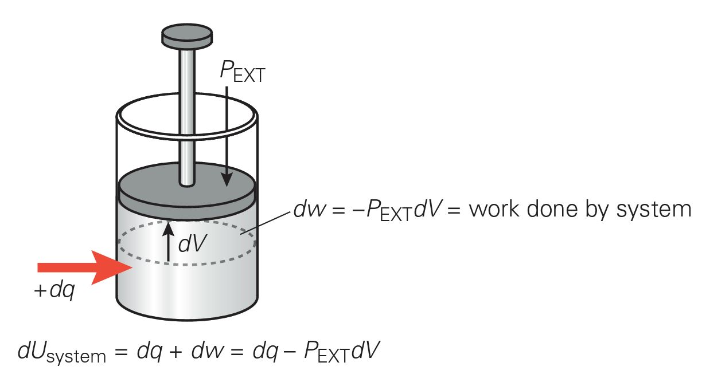

# Chapter 3 — Second Law: Entropy Increases

# Statistical thermodynamic definition: $S = k \ln W$
- Entropy *S* is a *state variable* that quantifies system *disorder*
- In an isolated system, changes *increase* entropy
- In an open system, entropy can *decrease* with a larger *increase in the* entropy of the environment
- Gibbs free energy $G = H - TS$ is another state function that determines whether a process will occur *spontaneously*; but not how rapidly it happens

## Recap of Ch2: Energy Is Conserved

### A system can exchange energy with its surroundings as ***heat*** **or** ***work***

**A piston of ideal gas is a convenient way to visualize exchange of heat and energy**

**The** ***First Law*** **says that Energy of the Universe is conserved**

$$dU_{total} = dU_{system} + dU_{surroundings} = 0$$
or,
$$dU_{system} + - dU_{surroundings}$$

**The change in energy of the system of determined by the about of heat transferred and work done**

$$dU = dq + dw$$

**If** ***no work*** **is done during the process, then the change in the energy of the system is equal to the heat transferred**

$$dU = dq$$

**In an isolated system (no heat exchange), energy can only be exchanged through work**

$$dU = dw$$

**Common scenarios**
**Constant Pressure Work**

**Constant Volume Heat Transfer**

**Constant Pressure Heat Transfer = Enthalpy Change**

### Example 3.1

1 mole of an ideal gas at *p_1* = 2 bar, *T* and *V_1* expands to *p_2* = 1 bar, *T* and *2V_1*. Consider two paths: (a) irreversible expansion into a vacuum, and (b) reversible expansion. Calculate $q$, $\Delta S_{system}$, and $\Delta S_{surroundings}$.

#### Solution:
First, $\Delta S_{system}$ is a state variable and should be independent of path, while heat flow *q* depends on path; so, $\Delta S_{surroundings}$ will differ for (a) and (b).

**Path a:**
From the First Law:

$w = 0$ (no work on surroundings)

$\Delta U = 0$ (internal energy is independent of volume)
So, $q_{irreversible}=\Delta U - w = 0$

Since there’s no work or heat exchange with the surroundings,

$$\Delta S_{surroundings} = 0$$

To compute $\Delta S_{system}$, we consider a reversible path:

$$w_{rev} = -\int^{V_2}_{V_1}pdV = -RT\int_{V_1}^{V_2} \frac{dV}{V} = -RT \ln \frac{V_2}{V_1}=-RT \ln 2$$

Then,

$$\Delta S_{system} = \frac{q_{rev}}{T}$$
